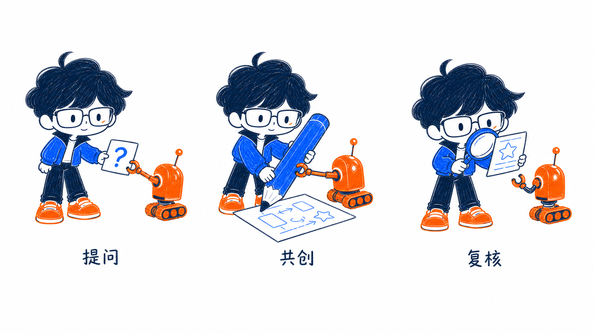

# YOLO Illustrations

> 把中文内容里的判断、流程、状态和隐喻，变成带个人 IP 的三色手绘知识配图。
>
> YOLO IP | 彩铅蜡笔 | 深海蓝 / 电光蓝 / 行动橙 | Codex Skill

## 这是什么

YOLO Illustrations 是一个 Codex Skill，用于为中文文章、帖子、博客、Notion 文档、AI 工作流和方法论内容策划、生成与编辑个人 IP 配图。

它不是通用插画 Prompt，也不是 PPT 信息图模板。它先寻找内容里的认知锚点，再让固定的 YOLO 角色通过一个明确动作，把抽象关系变成可见的物理隐喻。

## 输出类型

- **正文插图**：16:9，一张图解释一个结构、动作、状态或隐喻。
- **文章封面**：16:9，一个主场景、一个准确短标题。
- **观点卡片**：4:5，一个核心句、一个角色动作。
- **配图策略**：默认 4-8 张 shot list，标明放置位置、主题、结构、角色动作与标注词。
- **局部改图**：去错字、减元素、修身份和调整角色参与感。

## 视觉语言

- 纯白背景，大面积留白。
- 彩铅和蜡笔颗粒，轻微重复描线。
- 深海蓝 `#17243A`、电光蓝 `#2F6BFF`、行动橙 `#FF7A1A`，另使用白色负空间。
- 固定个人 IP：蓬松不对称头发、矩形眼镜、橙色脸部标记、蓝色工作夹克和橙色运动鞋。
- 角色必须亲自推动核心动作，不能只是角落装饰。
- 不做 PPT、科技 UI、复杂架构、商业矢量插画或儿童海报。

## 安装

从 `i-YOLO/skills` 仓库复制：

```bash
mkdir -p "${CODEX_HOME:-$HOME/.codex}/skills"
cp -R ./yolo-illustrations "${CODEX_HOME:-$HOME/.codex}/skills/"
```

本地开发可建立符号链接：

```bash
ln -s /absolute/path/to/skills/yolo-illustrations \
  "${CODEX_HOME:-$HOME/.codex}/skills/yolo-illustrations"
```

## 使用示例

只做配图策略：

```text
Use $yolo-illustrations 先不要生图。分析下面这篇文章，输出 5 张左右的 shot list。
```

生成正文插图：

```text
Use $yolo-illustrations 为这篇中文文章生成 4 张 16:9 正文插图。每张只讲一个认知动作。
```

生成文章封面：

```text
Use $yolo-illustrations 为“从工具到工作流”生成一张 16:9 文章封面。
```

生成观点卡片：

```text
Use $yolo-illustrations 为“先定义问题，再选择工具”生成一张 4:5 观点卡片。
```

局部改图：

```text
Use $yolo-illustrations 把这张图里的错误文字改正确，角色和其他构图保持不变。
```

## 身份资产

| 全身规范 | 头像 | 横幅 |
| --- | --- | --- |
|  |  |  |

## 校准图

校准图仅用于确认角色稳定性、留白、线条密度和颜色克制，不是可复制的构图模板。

### 正文插图

| 过滤噪音 | 上下文行李箱 | 人工判断闸门 | Agent 工作台 |
| --- | --- | --- | --- |
|  |  |  |  |

| 混乱到系统 | 反馈花园 | 学习路线 | AI 副驾驶漫画 |
| --- | --- | --- | --- |
|  |  |  |  |

### 文章封面

| 搭建你的 AI 系统 | 从工具到工作流 | 人机协作 |
| --- | --- | --- |
|  |  |  |

### 观点卡片

| 先定义问题，再选择工具 | 不要堆工具，要搭系统 | 反馈让能力复利 |
| --- | --- | --- |
|  |  |  |

## 目录结构

```text
yolo-illustrations/
├── SKILL.md
├── README.md
├── LICENSE
├── NOTICE.md
├── agents/openai.yaml
├── assets/
│   ├── identity/
│   └── examples/
└── references/
    ├── character-ip.md
    ├── style-dna.md
    ├── composition-patterns.md
    ├── prompt-template.md
    └── qa-checklist.md
```

## 致谢与许可

工作流与渐进式文档结构参考并改写自 [Ian Xiaohei Illustrations](https://github.com/helloianneo/ian-xiaohei-illustrations)，原项目采用 MIT License。当前角色规范、三色画风和全部图片资产均已替换为 YOLO 个人 IP。详见 [NOTICE.md](NOTICE.md) 与 [LICENSE](LICENSE)。
